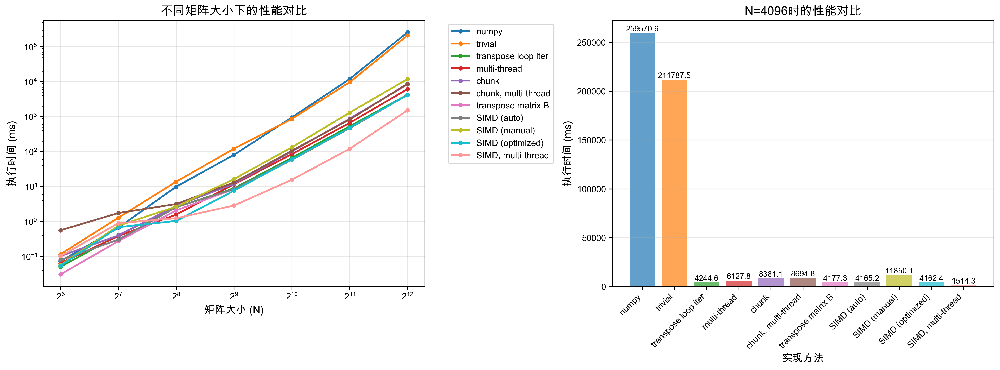
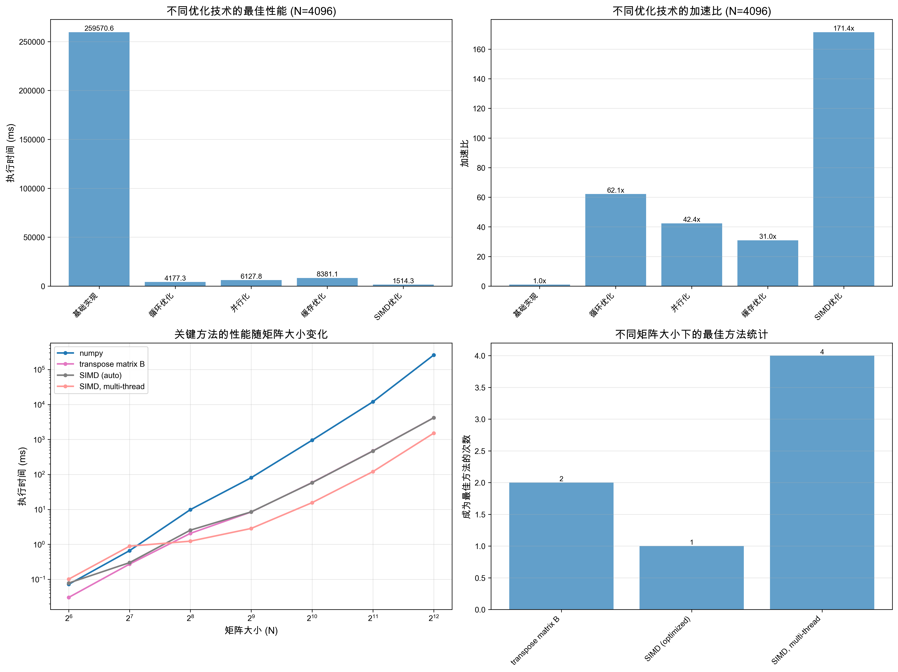
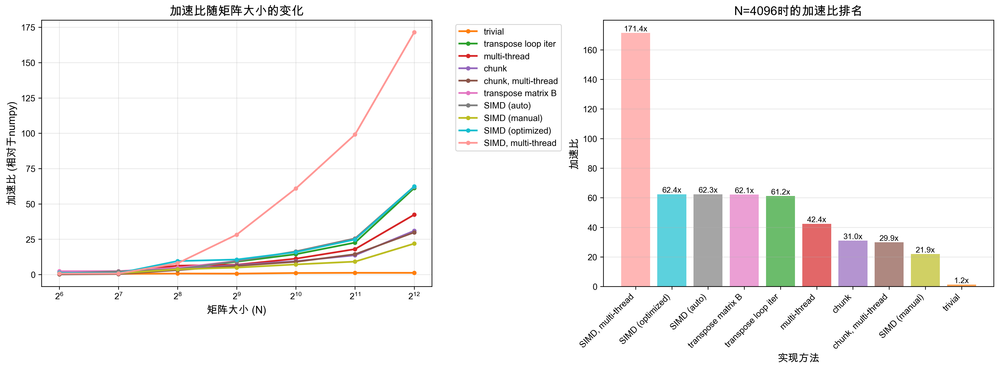

# Matmul

> Assignment for assembly course in UCAS

## Build

```
xmake # depends on uv the python package manager
```

## Run

```
uv run benchmark/main.py --help
```

---

## Benchmark

```
Speedup over numpy (size=4096):
  numpy              : 1.0000x
  trivial            : 1.1768x
  transpose loop iter: 57.1368x
  multi-thread       : 41.0148x
  chunk              : 31.3374x
  chunk, multi-thread: 33.7665x
  transpose matrix B : 57.6803x
  SIMD (auto)        : 61.9894x
  SIMD (manual)      : 21.9424x
  SIMD (optimized)   : 62.3928x
  SIMD, multi-thread : 164.1845x
```







